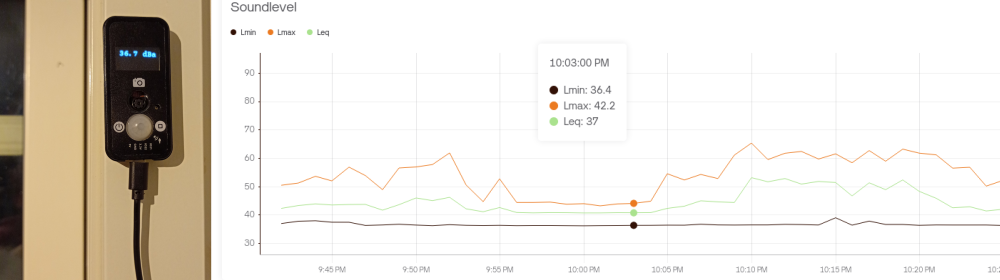
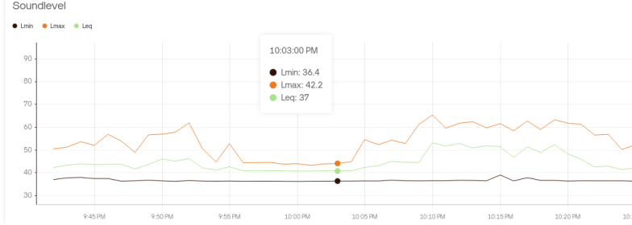
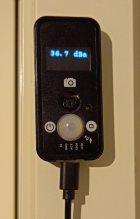

# Sound level meter

This is a sound level meter implemented in MicroPython with emlearn-micropython.
This can be used for basic sound measurements or noise monitoring over time.
It can also be used as a starting point for other applications that need to process sound.

The core code can be run on any MicroPyton port (including PC/Unix),
but to run the on-device examples you will need particular hardware (see hardware requirements section).



## Features

The [soundlevels.py](soundlevels.py) module implements the standard processing typically used in a
sound level meter used for noise measurements:

* Computes soundlevel in decibels SPL, using a digital microphone
* Supports *A* frequency weighting, or no weighting (*"Z"*)
* Supports *Fast* (125ms), *Slow* (1second) or *no* time integration.
* Supports showing the instantaneous sound level (short Leq)
* Supports summarized measurements: equivalent sound pressure level (Leq), minimum (Lmin), maximum (Lmax)
* Supports percentile-based summarizations: L10, L50, L80 etc (configurable)
* Supports 16 kHz sample rate

The following emlearn functionality are used in the implementation:

- `emlearn_iir`. IIR filters to implement the A weighting filter
- `emlearn_arrayutils.linear_map()`. To convert array values between `float` and `int16`


#### Notes on measurement correctness

NOTE: In order to have reasonable output values,
the *microphone sensitivity* **must be correctly specified**.
Ideally you also check/calibrate the output against a know good sound level meter.

NOTE: There is no compensation for non-linear frequency responses in microphone.

NOTE: processing is done largely in int16, which limits the dynamic range.

So the practical accuracy of your measurements will vary based on your hardware (microphone) and these limitations.
Generally this kind of device will be most useful to track relative changes,
and less useful for measuring against an absolute threshold limits (as specified in various noise regulation).
For known performance, get a sound level meter with a class rating (2/1), preferably with certification.

## Hardware requirements

The device must have an **I2S** digital microphone.
*PDM* microphone will not work, as they are not yet support in MicroPython (as of late 2024).

The microcontroller used must support the `machine.I2S` MicroPython module.
An ESP32 based device is recommended. But RP2, stm32, mimxrt also support I2S.
More information about I2S in MicroPython at [miketeachman/micropython-i2s-examples](https://github.com/miketeachman/micropython-i2s-examples).

Tested devices:

- LilyGo T-Camera Mic v1.6

Untested devices. Theoretically compatible by changing pinout

- [LilyGo T-Camera S3](https://www.lilygo.cc/products/t-camera-s3)
- Generic ESP32 with external I2S microphone breakout

Please report back if you get this running on a device not listed here.

## Install requirements

Make sure to have Python 3.10+ installed.

Make sure to have the Unix port of MicroPython 1.23 setup.
On Windows you can use Windows Subsystem for Linux (WSL), or Docker.

Install the dependencies of this example:
```console
python -m venv venv
source venv/bin/activate
pip install -r requirements.txt
```

## Example: Compute soundlevel for an audio file (on host/PC)

Install the emlearn modules
```console
micropython -m mip install https://emlearn.github.io/emlearn-micropython/builds/master/x64_6.3/emlearn_arrayutils.mpy
micropython -m mip install https://emlearn.github.io/emlearn-micropython/builds/master/x64_6.3/emlearn_iir.mpy
```

Compute soundlevels for a file
```console
micropython soundlevel_file.py test_burst.wav
```

The output is newline-delimited JSON ([NDJSON](https://github.com/ndjson/ndjson-spec)).
If you want some other format, like CSV - modify the example code.

## Running on device (ViperIDE)

The fastest and easiest to to install on your device is to use Viper IDE.
This will install the library and the example code automatically.
[](https://viper-ide.org/?install=github:emlearn/emlearn-micropython/examples/soundlevel_iir)

In Viper IDE, you can select which example file to run (described below),
and hit the Play button to run it.

## Example: Compute soundlevels on device

Flash your device with a standard MicroPython firmware, from the [MicroPython.org downloads](https://micropython.org/download/).

Ensure you have an I2S microphone, and that the pinout is correct in `soundlevel_live.py`.

Install the emlearn modules *for your architecture*. ESP32=xtensawin
```console
mpremote mip install https://emlearn.github.io/emlearn-micropython/builds/master/xtensawin_6.3/emlearn_arrayutils.mpy
mpremote mip install https://emlearn.github.io/emlearn-micropython/builds/master/xtensawin_6.3/emlearn_iir.mpy
```

Copy example code to the device
```console
mpremote cp soundlevel.py :
```

Run
```console
mpremote run soundlevel_live.py
```

It should show the current soundlevel, which reacts instantly to sound changes.
Every 10 seconds the summarized soundlevels should be logged.


## Example: Log soundlevels to cloud over WiFi

This requires a device which has support for `network.WLAN` MicroPython module.
Typically an ESP32 or RP2.

This example uses the [Blynk](https://blynk.io/) IoT platform.
So you will need to register for an account there (free plan is sufficcient).

After you have registered, you will need to 1. Create a Template, 2. Create datastreams, 3. Create a dashboard, and 4. Register a Device.

#### Create Blynk Template

The Template structure in Blynk has all the setup related to one type of device,
including the datastreams, dashboard, and devices.

Go to **Developer Zone -> My Templates**, and hit ***New Template**.

- Name: Soundlevel Meter
- Hardware: ESP32
- Connection Type: WiFi

For reference, see [Blynk.io: Template Quick Setup](https://docs.blynk.io/en/getting-started/template-quick-setup).

#### Setup Blynk Datastreams

Create 3 *Virtual Pin* Datastreams for the Template.
The names/pin should be: Leq/V2, Lmin/V3, Lmax/V4.
Each should have the following configuration:

- Data Type: Double
- Min: 20
- Max: 120
- Enable History Data: Yes

Remember to hit **Save and Apply** after adding the datastreams.

For reference, see [Blynk.io: Set Up Datastreams](https://docs.blynk.io/en/getting-started/template-quick-setup/set-up-datastreams).

#### Create Blynk Web Dashboard

- Go to the *Web Dashboard* tab, click *Edit*
- Add a *Chart* widget
- Edit the Chart widget, and add the 3 datastreams. Leq,Lmin,Lmax
- Save the dashboard

For reference, see [Blynk.io: Set Up Web Dashboard](https://docs.blynk.io/en/getting-started/template-quick-setup/set-up-web-dashboard).


#### Register a device in Blynk

- In the right hand menu of Blynk dashboard, select `Devices -> Create New Device`.
- Make sure that the selected **Template** is "Soundlevel Meter".
- Hit **Create** to register the device
- Copy the **Auth Token**, you will need it in the next step.

For reference, see [Blynk.io: Manual Device Activation, Getting Auth Token](https://docs.blynk.io/en/getting-started/activating-devices/manual-device-activation).

#### Setup the device

Put your *WiFi network name (SSID)*, *WiFi password* and *Blynk auth token* into a file called `secrets.py`.
Use the following variable names.

```python
BLYNK_AUTH_TOKEN = 'MY TOKEN HERE'
WIFI_SSID = 'MY WIFI SSID'
WIFI_PASSWORD = 'MY WIFI PASSWORD'
```

Install the emlearn modules *for your architecture*. ESP32=xtensawin
```console
mpremote mip install https://emlearn.github.io/emlearn-micropython/builds/master/xtensawin_6.3/emlearn_arrayutils.mpy
mpremote mip install https://emlearn.github.io/emlearn-micropython/builds/master/xtensawin_6.3/emlearn_iir.mpy
```

Copy example to the device
```console
mpremote cp secrets.py iot_blynk.py soundlevel.py :
```

Run the example
```console
mpremote run soundlevel_iot.py
```

You should see some log output, and within 30 seconds you should see the first attempts to send data to Blynk.
If the status code is 200, then you should see data appear in your dashboard.




## Example: Show soundlevels on screen

This example requires hardware with **SSD1306 display**,
in addition to an I2S microphone.
It uses [micropython-nano-gui](https://github.com/peterhinch/micropython-nano-gui) for the screen.
So the example can be adapted to other displays supported by that framework.

Install the emlearn modules *for your architecture*. ESP32=xtensawin
```console
mpremote mip install https://emlearn.github.io/emlearn-micropython/builds/master/xtensawin_6.3/emlearn_arrayutils.mpy
mpremote mip install https://emlearn.github.io/emlearn-micropython/builds/master/xtensawin_6.3/emlearn_iir.mpy
```

Install UI framework and screen driver
```console
mpremote mip install "github:peterhinch/micropython-nano-gui/drivers/ssd1306"
mpremote mip install "github:peterhinch/micropython-nano-gui"
```

Copy example to the device
```console
mpremote cp color_setup.py soundlevel.py :
```

Run the example
```
mpremote run soundlevel_screen.py
```

The screen should update continiously to show the current sound level.



## Development

### Running automated tests

Run automated tests
```console
python test_soundlevel.py
```

